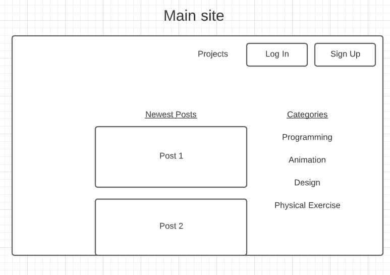
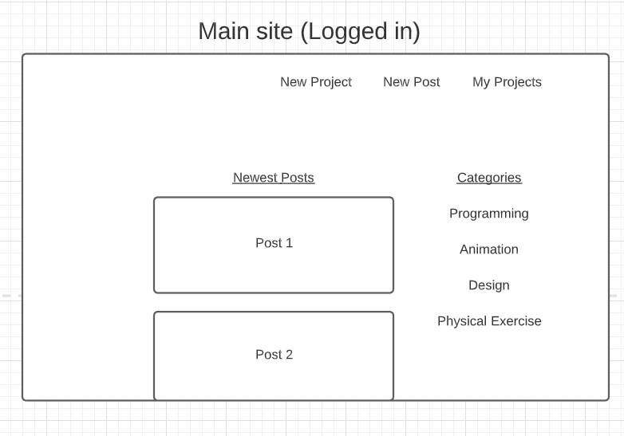
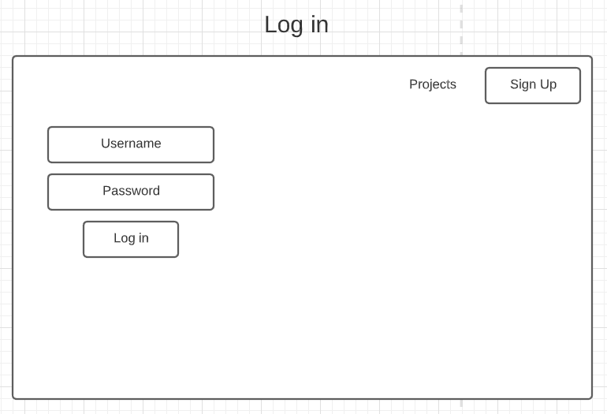
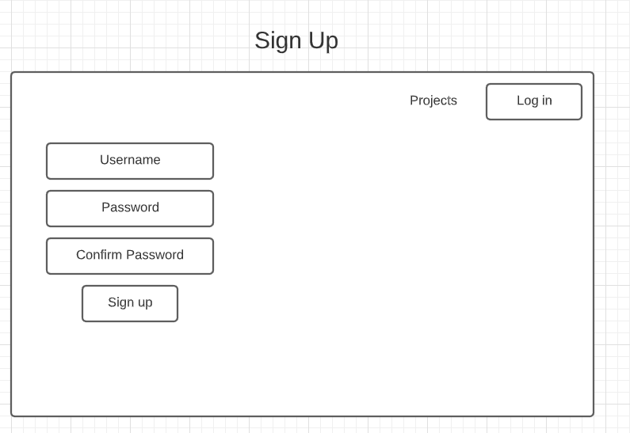
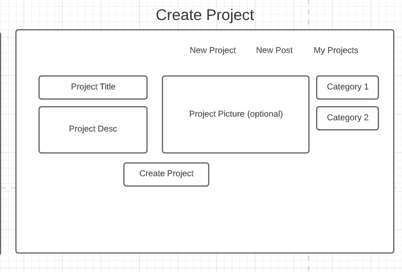
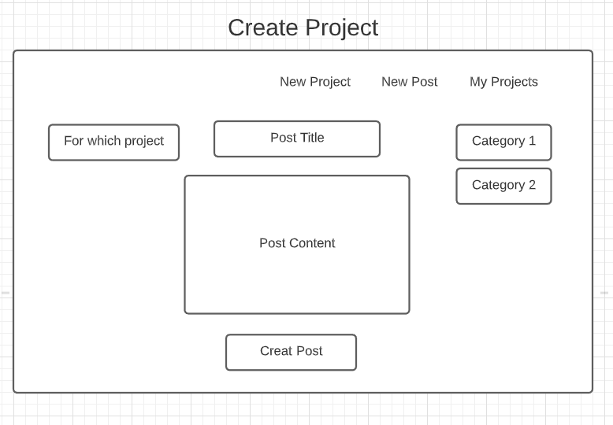
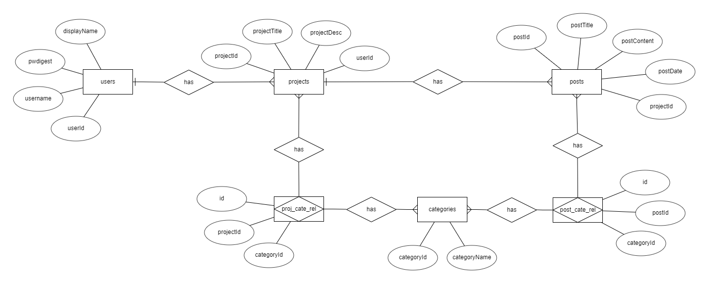

# Projektplan

## 1. Projektbeskrivning (Beskriv vad sidan ska kunna göra).
- Skapa konto.
- Logga in.
- Skapa Projekt.
- Skapa Projektpost.
- Visa alla projekt och specifika posts.
## 2. Vyer (visa bildskisser på dina sidor).

## 3. Databas med ER-diagram (Bild på ER-diagram).

## 4. Arkitektur (Beskriv filer och mappar - vad gör/innehåller de?).

